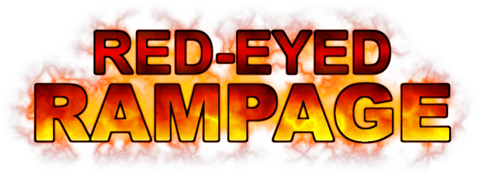

---

## What?

Hey what if you played as **Saya** wouldn't that be really cool and fun?

Now seriously, I feel like making separate mods for certain **Codename: Demolitionist** side characters would result in some very interesting opportunities to experiment with other playstyles.

So, basically the story here is simple. Everyone knows that **Saya** just sits back and watches as others do all the fighting for her, right? She's just lazy, a coward, that's what everyone says. And the words of those people, they hurt. She can't help but feel like they're right. So why not shut them all up by going out there and kicking some ass by yourself? Yeah, there's no way this will go wrong, or cause you some form of long-lasting trauma...

---

## Abilities

As descendant of **Princess Kaguya**, **Saya** is immortal through the blood of her grandparents, who imbibed the **Hourai Elixir**. But that's not all, as despite being so small and frail looking, she's a natural at moving quickly, dashing and dodging. She's definitely got quite a lot of strength in those legs of her, which is also useful in close combat. Apart from the physical aspects, she's of course proficient in spellcasting, but also being a gun nut as she is means she won't just use magic to defend herself, but also various weapons of her own choosing. Do note that unlike the very robotic **Demolitionist**, she's a human, and as such will have a greater vulnerability to most forms of damage. You however can't drown, because **Saya** isn't an idiot and she brought along a rebreather that feeds air directly from hammerspace. Oh, and fall damage? Don't worry about that, this is **Doom**, there's no such thing as fall damage here *(unless the mapper decides to enable it)*.

One must be reminded that the **Hourai Elixir** grants an individual what's basically *"divine immortality"*, that is, the ability to recover from death, even if the entire body itself is destroyed, for all of eternity. Even if demons tear your flesh to ribbons, you will return, angrier and more vengeful than before. Upon your fall, you can resort to destroying your body *(and nearby foes as a bonus)*, and then a new *"you"* will be reborn nearby, somehow **still wearing clothes** *(Yeah, that's something very peculiar about this phenomenon)*.

Keep in mind, however, that if you die a horrible death and have to *"respawn"*, all your stuff will remain in the backpack you had in your previous body *(which thankfully survived the blast)*, so you'll need to recover it. This normally wouldn't happen with military-grade dedicated **Hammerspace** devices, but you're a civilian, so things won't be that convenient *(Note: For the sake of gameplay sanity, keys don't get taken away)*.

Do note that you are very squishy, but you can try again and again no matter how many times you die. The game is over when **YOU** give up.

---

## Weaponry

As a civilian, **Saya** shouldn't be carrying any weapons, but who's going to stop her when there's still demons out there left to kill? All that time playing games, watching videos, and even toying with some guns at the range should definitely pay off in being able to wield any weapon she can find lying out there. And of course, she's also not afraid to punch and kick her way to victory. She may not look like much, but she can kick very hard *(something that appears to run in the family)*.

The operation of all weapons is fairly simple: Primary fire shoots and reload... reloads. **Saya** managed to strike a special deal in the last second to have an autoloader in her hammerspace *(which is normally exclusive to military models)*, so don't worry, no manual mag management will be involved here either.

Of course, having a smaller hammerspace also means she can't hold as many weapons as she'd like, so you'll notice a bit of a size reduction in the available weapon slots.

As per usual, with any weapon out, there is a dedicated *"quick kick"* button, so you can showcase the mighty power of your bloodline on some poor saps *(aiming at center of gravity for a guaranteed stun)*.

### Slot 1 - Unarmed *[Fist, Chainsaw]*

*"What? You think I'm some sort of weakling?"*

Raise up your fists to attack the opponent. It may not be very effective, usually, but even the mightiest tree can be felled with enough perseverance.

Note: Taking the place of the **Chainsaw** are a pair of **Brass Knuckles**, which will permanently enhance your punching damage.

### Slot 2 - Akari Mag Pulsor *[Pistol]*

*"Hey, it's for self-defense, you know..."*

A simple self-defense weapon that releases potent, disrupting electromagnetic pulses. The potency of the pulse can be increased by holding down the trigger for a longer time. The specific model that **Saya** uses can be loaded with 4mm bolts to further increase the lethality of its shots by actually having a solid payload. Up to 6 of them fit inside the internal magazine.

### Slot 3 - Siesta "Goldsmith" Sawed off *[Shotgun, Super Shotgun]*

*"闇を切り裂く、ＯＨ　ＤＥＳＩＲＥ〜！"*

Chambered for .45LV, this *"relic"* has been in **Saya**'s private collection since the early days. She likes taking it to the range and attempting to cycle it *"the cool way"* while she pretends to shoot down *"goat servants"* or something. Well, now she can definitely shoot some goats with it, for sure.

Can hold 4 rounds plus one in the chamber. Fairly useful for stopping hell nobles in their tracks. Timing your shooting and cycling adequately will cause **Saya** to spin the gun, for increased coolness.

#### .45LV Rounds *[Shells, Shell Box]*

Will pop up either scattered around or in packs.

### Slot 4 - Akari "Hyperion" Gauss Rifle *[Chaingun]*

*"The future is in electromagnetic weapons, not that caseless bullshit from **Volt**."*

One of the very first specialized coilguns built at **Akari Labs**. **Saya** herself considers it *"stupid"* to call it a *"gauss rifle"*, citing that such a name is *"just sci-fi mumbo jumbo"*. This weapon fires magnetized 4mm bolts tipped with a potent shock charge, stunning targets and dealing some nasty pain. With a *"blazing"* fire rate of 420 RPM, this puppy can sure bite hard.

Each mag holds 50 rounds, allowing you to spend a whole seven seconds of firing away without a single interruption.

#### 4mm EC Shock-Tip Bolts *[Clip, Bullet Box]*

Found as either full mags or handfuls of bolts.

### Slot 5 - Cryptik "Punisher" Plasma Grenade Launcher [Rocket Launcher]

*"The only thing that bothers me about this is how absolutely shiny and chrome it is, seriously."*

The very first plasma grenade launcher devised by **Cryptik Arms**, and it shows. It's gone through several revisions, to the point of being *"absolutely perfected"*. It seems that in the process this also has translated to being so polished you can see your own reflection on it. Nevertheless, it's a very effective weapon, capable of obliterating targets quickly. Although its splash damage potential is very restrictive, a direct hit is absolutely lethal.

Magazines have 6 rounds. Do note that the weapon is open bolt, so that's absolutely as many as you can get.

#### 40mm Plasma Grenades *[Rocket, Rocket Box]*

As single rounds or small bunches.

### Slot 6 - Nekuratek "Nabikuni" *[Plasma Rifle]*

*"I cast fuck you on your sorry ass."*

The *"Verdant Mage"* is one of **Nekuratek**'s few still surviving plasma weapons. Capable of delivering bursts of burning **Dyratin** plasma at a steady 700 RPM, it could be described almost as a *"plasma hose"* of sorts.

Rather than *"rounds"*, the magazine holds 300mL of pressurized Dyratin. 5mL are consumed per shot, so this thing will let you unload steadily for up to 5 seconds before reloading.

#### 300mL Dyratin Cell *[Cell, Cell Pack]*

A handful of plasma, in a can. Or several cans.

### Slot 7 - Cryptik "Malefactor" Plasma Caster *[BFG9000]*

*"Eat flaming neon death."*

Yet another lawsuit that **Cryptik Arms** managed to skillfully dodge, this time coming from the **UAC** themselves. Suspiciously similar to certain prototypes from their **Botis Field Glyph** project, but distinct enough to be its own weapon, the **Malefactor** is a devastating directed energy weapon that releases searing arcs of plasma towards ionized targets. The more targets that are to be struck, the lesser the individual damage may be.

Each "magazine" allows for 8 individual shots, as well as serving to power the entire weapon itself.

#### Caster Feed Module *[Cell Pack (rare)]*

You'd be lucky to find extra ammo around, unless it's from another BFG spawn.

### Slot 8 - Furious Warhammer *[Chainsaw]*

*"Kira-sama... Thank you."*

A gift from the **God of Fury** himself, who values **Saya** greatly as a friend. It is his very own weapon that he employs to defend the **Votrexxian** people. Even in the hands of a puny human, its strength will remain the same as if it were wielded by its own creator.

Attack with a strong overhead swing, capable of crushing even the beefiest of enemies. This action is heavily strengthened provided the weapon has energy, but even without a charge it's still fairly potent.

Energy for this weapon is limited when not wielded by its rightful owner, and once it fully drains, the weapon must be recharged by **Kira** himself. It will start replacing the **Chainsaw** once the **Brass Knuckles** have been obtained. Once the hammer is within your grasp, any further pickups will be replaced by small shrines where you can recharge it.

### Ninnacht Jackhammer *[Blursphere]*

*"This fucking thing has no right to exist."*

The weapon that brought **Ninnacht Armaments** to ruin, the most disastrous thing ever conceived. Its very existence is a mistake. A fully automatic 12-gauge shotgun with a 12 shot drum magazine that requires full gun disassembly to replace. Only a couple prototypes were made. Ex-CEO **James Heinen-Bradstenfeldt** suggested at the time that should any remaining prototypes be found, they must immediately be dropped into an active volcano.

**Saya** will simply throw it away after those 12 shots. If you keep it idle for a while, she'll throw it away on her own anyway because it sucks. She also refuses to put it into her inventory, so switching from it also throws it away. She will not pick it back up again afterwards, and you will never see it spawn ever again. Any further Blurspheres you encounter will be replaced by grenades.

## Spellcasting

As someone of such an upbringing as she is, **Saya** is no stranger to magic, and her specialty lies in so-called ***"Spellcards"***: Specialized spells with limited use but quite mighty potential. Each is selected independently from whichever weapon you're using, and they can cast at any time. After use, you will have to wait for your mana to replenish in order to use another one. Note that each of these requires increasingly more mana then the previous, so the strongest attacks will take much longer to become available once again.

### Spellcard: Reviled Sign "Igneous Lexicon"

*"Words that kill..."*

Blinding trails of hateful energy that burst into very, VERY painful words.

All the words seem to be in **English**.

### Spellcard: Retribution Sign "Ride to Hell"

*"This is totally not a reference to anything I swear."*

A steady burst of seeking beams of fiery energy that explode on impact, bursting into deadly heat. Each beam deals exactly 1% of the enemy's total health pool in damage, making this especially effective against heavy targets.

The beams appear to make motorbike revving noises as they travel.

### Spellcard: Rude Sign "Saturation Barrage"

*"What? Like... Just dodge through it? It's not that hard."*

One of the spellcards that got **Saya** banned from duels. The amount of projectiles on display is said to be so dense it's practically impossible to avoid without extreme luck.

It really is just too much, no wonder people refuse to duel her.

### Spellcard: Radiant Sign "Aureous Flare"

*"Hey, check out how hard I can pee!"*

**Saya**'s most powerful spellcard, and one entirely of her own creation. She claims this rivals even the mighty **Master Spark** in potency. Whether using primary or secondary fire, the effect is all but the same: Upon being charged, a swirling mass of incandescent tendrils will be released in a wide arc, penetrating even the thickest walls, stopping at nothing in their path of destruction.

**Saya** seems to always cast this one with both hands at her crotch, index fingers extended, as if mimicking the act of urinating with a penis.

## Items

You can't just go out there and expect to do everything without help. And so, the many items come to play.

### Cookie *[Health/Armor Bonus]*

*"I haven't played Cookie Clicker in decades. Wonder if it still even exists..."*

It is said that whoever controls the cookies, may one day control the universe. Each of these heals up for 1 HP. Sometimes you might find them in bunches, healing even more.

### Stimmy Pack *[Stimpack]*

*"A stimmy pack, for the small ouchies."*

Each of these contains a small health stimulant. And yes, **Saya** really does call them that. On a normal person, injecting several of these at once would result in an overdose, but **Saya** doesn't seem to be affected. Each recovers 15 HP.

### Big Stimmy Pack *[Medikit]*

*"Big stimmy, for the bigger ouchies."*

These ones contain all sorts of medical equipment to patch up wounds and treat burns. Fairly useful, certainly. Each recovers 30 HP.

### Spiritual Stimulant *[Soulsphere]*

*"Glad I'm compatible with these, just like Ibuki is. Means I can just drink the stuff without basically blowing myself up in the process. No bullshit ultra failed heals here."*

A boost of 100 HP with each use. There is no upper cap to how much you can get out of these, although going over 100 HP will make your health drop faster and faster. Proven to be lethal for mortals if overused *(good thing you're not mortal)*. Always automatically used on pickup.

### Armor Padding *[Green Armor]*

*"Don't wanna have no accidents, you know..."*

Protection for your head and your joints. The usual stuff you'd wear for a bike ride, basically. 100 points of armor, absorbing one third of all damage. Can only hold one spare.

### Shielded Vest *[Blue Armor]*

*"Shit's heavy, but it's worth it to play it safe."*

Thick shielded plating for your chest and back, providing very decent protection. A whopping 500 points of armor, absorbing two thirds of all damage, plus three quarters of all splash damage. Reduces your movement speed by 25% while worn. Likewise, you can only hold one spare of it, too.

### Shield Orb *[Megasphere]*

*"Ooooooooooooorb..."*

Works as an extra layer of protection on top of all your other armor. Lasts for about three minutes, although its duration will drain faster the more damage it has to absorb. Also has the added effect of restoring you to 100% health.

### Hammerspace Embiggener *[Backpack]*

*"That nerd... Well, I do guess it's perfectly cromulent to use this."*

Expands the ammo storage of your backpack. As a civilian, you don't get any spare ammo from this, and you can only upgrade four times. Note also that the expansion only affects the backpack they were used with, so make sure you recover your stuff on death or you'll lose that extra storage.

### Zar Bomb *[Blursphere]*

*"Jesus fucking christ, Misa... This is too hardcore."*

A potent magic grenade for adventurers. Very useful in a pinch, just make sure to not get too close. If it looks familiar, that's because this is the design **Saya** copied for the **Safety Tether**. As a matter of fact, they have a lot more in common than you might expect.

These aren't really a usable item so much as something accessed through a **"Quick Grenade"** button, though.

### Maximum Bepis *[Berserk]*

*"Good god, you can really TASTE the bepis."*

An energizing, refreshing drink. Gives off some health regen while also enhancing your speed and physical strength.

### Omnisight *[Computer Map]*

*"People worked hard to fill in the data in these... They have all my respect, and their sacrifice won't be in vain."*

Plugged into **Saya**'s tablet, this will fill in the rough outline of the map.

### Red Oni Milk *[Invulnerability]*

*"It's just so strong, it really invigorates you, to the point of making you feel unstoppable after chugging an entire bottle of the stuff. And it tastes excellent to boot."*

Fresh off the big woman herself, this will provide not only a full heal, but also temporary invincibility. Become unstoppable, through the power of giant titties.

### Glow Visor *[Lite-Amp]*

*"My vision is augmented..."*

Night vision goggles that can be toggled *(hey, that rhymes)*.

### Elemental Coating *[Radsuit]*

*"Well, if it works for them, it should work for me."*

Allows you to harmlessly wade through hazardous liquids for a limited time.

---

## Compatibility

Yeah this one's **Doom** exclusive, sorry. That's really what the plot expects. Obviously, the same notes are here about the vanilla campaigns not being canon.

---

*"The memories of those days will haunt me forever. Flashing images of my own guts strewn about, of demons feeding on my bones, of dying over and over again... My own stubbornness can really put me in danger."*
